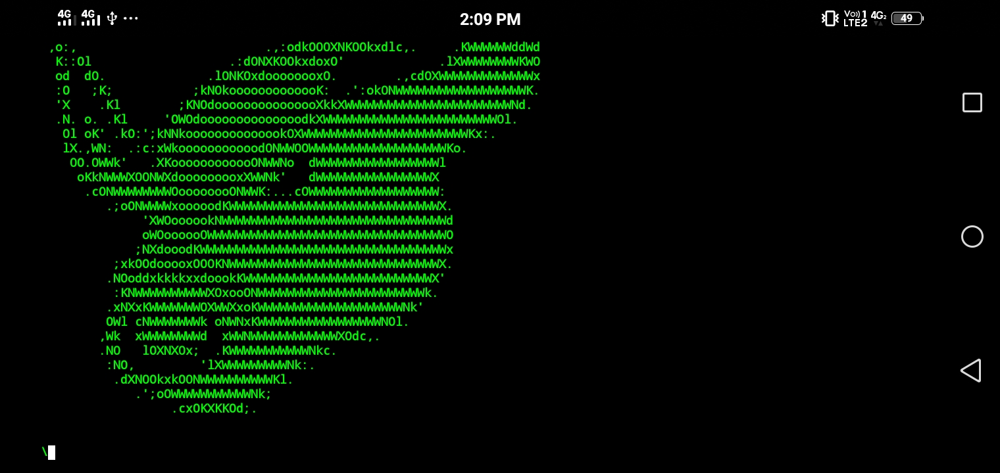

Here's the updated version of the instructions based on your input:

# ☣️ Beef ☣️
Hey guys, Beef Tool on Termux can be easily installed and used without 'Root'.

# Beef Tool
The Beef Tool is a browser exploitation tool, and it is a pentesting tool...



# ⚠️ This Tool is Tested On 
This tool only works on Termux.  
If you want to use it on PC, go to the Beef website:  
- 👍 [https://beefproject.com/](https://beefproject.com/)

# 🛑 Installation and Requirements 🛑

1. Install `git`:
   ```bash
   apt-get install git -y

2. Clone the Beef tool repository:

git clone https://github.com/edunoluwadarasimidavid/Beef-in-termux-.git


3. Change directory to the cloned repository:

cd Beef-in-termux-


4. Make the installer script executable:

chmod +x Installer.sh


5. Run the installer script:

./Installer.sh


6. After setup, go to the home directory and run Beef. The script will install on your Termux:

beef
